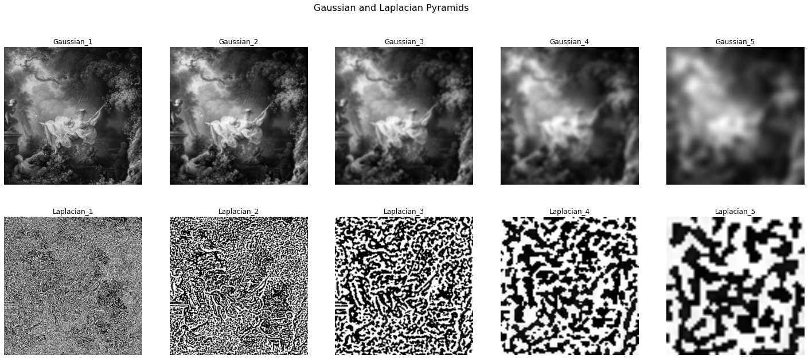
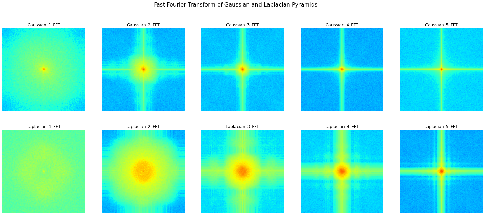
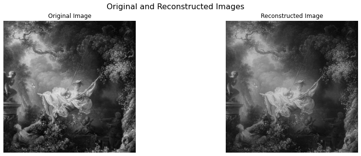

# Gaussian-and-Laplacian-Pyramid
The Gaussian pyramid provides a representation of the same image at multiple scales, using simple lowpass filtering and decimation techniques. The Laplacian pyramid provides a coarse representation of the image as well as a set of detail images (bandpass components) at different scales. This program generates both at various N values

## Overview
Choose an image that has interesting variety of textures (from Flickr or your own images). The images should be atleast 640X480 pixels and converted to grayscale. Write code for a Gaussian and Laplacian pyramid of level N (use for loops). In each level, the resolution should be reduced by a factor of 2. Show the pyramids for your chosen image in your write-up. Here is an [example](https://drive.google.com/uc?id=17Y287EA-GJ2z0wtm_M7StIWsXyFeHvrz).

In Gaussian pyramid, smoothing removes high-frequency components resulting in aliasing and displays low resolution images as the number of levels increase.The images lose image-structure information corresponding to high frequency components, decreasing the image quality. 

In Laplacian pyramid, images are obtained from lost high- frequency components and these lost frequencies of the images can be regained.

The Gaussian and Laplacian pyramids, retain the superior frequency orientations and their corresponding low and high frequency components respectively.


# Results

<table>
    <tr><td> </td></tr>
    <tr><td> </td></tr>
    <tr><td> </td></tr>
</table>

# Folder Structure
```
📦Gaussian-and-Laplacian-Pyramid
 ┣ 📂Results
 ┃ ┣ 📜output.png
 ┃ ┣ 📜output_2.png
 ┃ ┗ 📜output_3.png
 ┣ 📜.gitignore
 ┣ 📜GaussianLaplacianPyramids.ipynb
 ┣ 📜LICENSE
 ┗ 📜README.md
```